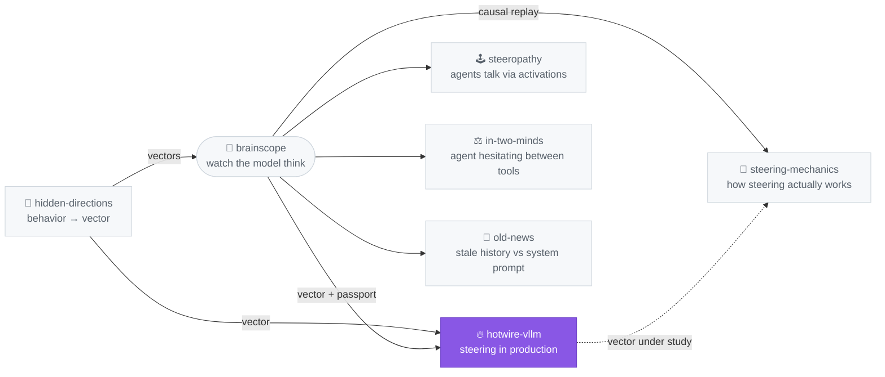

# hotwire-vllm

[](https://pypi.org/project/hotwire-vllm/)

```
pip install hotwire-vllm
```

**Activation steering for vLLM that doesn't turn off the engine.**

For teams running vLLM in production who need per-request activation
steering at native speed — CUDA graphs and torch.compile intact.

> **Status: instrument.** hotwire is serving infrastructure — it makes
> per-request steering *possible* in production; whether steering
> *behaves well* there is an open research question, studied as work in
> progress (small N, not enough statistics yet) in
> [steering-mechanics](https://github.com/moudrkat/steering-mechanics).

Every steering tool for vLLM that installs without forking it ([vllm-lens](https://github.com/UKGovernmentBEIS/vllm-lens),
[EasySteer](https://arxiv.org/abs/2509.25175), IBM's vLLM Hook) forces
`enforce_eager=True`: PyTorch forward hooks don't survive CUDA graph capture, so
they disable CUDA graphs and torch.compile for the whole server — every request
pays, steered or not. Fine for research, a non-starter for production.

hotwire keeps the graphs. The steering addition is a custom torch op (Triton
kernel) that gets baked *into* the captured graph; per-request routing happens
by updating the contents of persistent GPU buffers between graph replays —
the graph reads fresh data at the same addresses.

The technique was proven viable in [RhizoNymph's vLLM fork](https://github.com/RhizoNymph/vllm)
(see [RFC #36998](https://github.com/vllm-project/vllm/issues/36998), where
in-flight steering is explicitly deferred to "Phase 2"). hotwire packages it as
an out-of-tree plugin: `pip install`, no fork, registered via vLLM's official
`general_plugins` entry point.

## ⚡ Run in 30 s

```bash
pip install hotwire-vllm                  # registers the vllm.general_plugins entry point
export HOTWIRE_VECTORS=/path/to/vectors   # dir of .pt files (or one .pt): (n_layers, hidden), or a single-layer (hidden,) vector
vllm serve Qwen/Qwen3-4B-Instruct-2507    # CUDA graphs stay ON
```

No vector yet? [`python -m hotwire.verify`](#verify-on-your-hardware) makes
a throwaway one and checks the whole path on your GPU.

`HOTWIRE_VECTORS` accepts a directory of `.pt` files or a single `.pt`; each
file is a `(n_layers, hidden)` matrix or a `(hidden,)` vector usable at any
layer (a dict-wrapped tensor works too — the first tensor wins). The
vector id is the file name without `.pt`.

Steer any request by id + layer + scale:

```python
# offline
SamplingParams(extra_args={"hotwire": '{"id": "tesla_car", "layer": 20, "scale": 1.5}'})
```

```bash
# OpenAI API
curl .../v1/chat/completions -d '{..., "vllm_xargs":
  {"hotwire": "{\"id\": \"tesla_car\", \"layer\": 20, \"scale\": 1.5}"}}'
```

Unsteered requests — including batchmates of steered ones — are untouched.
Malformed specs and unknown vector ids degrade to "unsteered", never to a
failed request.

Optional per-entry flag `"decode_only": true` skips every multi-token span
(the prefill) and steers single-token decode steps only — use it for
vectors calibrated on generation-only steering
(research rigs typically don't steer the prefill; applying such a vector to a
long prompt as well multiplies the effective dose and can wreck coherence).

Lab twin: [brainscope](https://github.com/moudrkat/brainscope) accepts this
exact spec and wire format — calibrate a vector under its lenses (its
`export_hotwire` ships `.pt` files with a regime passport), deploy it here
unchanged, and replay production conversations back under the lens when a
vector misbehaves.

## Verify on your hardware

Two commands, ~3 minutes on any CUDA box with vLLM installed:

```bash
pip install hotwire-vllm
python -m hotwire.verify --model Qwen/Qwen3-0.6B   # any HF model id works
```

It generates a throwaway steering vector for the model, checks that steering
fires, that unsteered requests (including batchmates) are untouched, and
compares decode cost idle vs all-steered — then prints a report block.
**Please paste the report into an issue**, especially from hardware, model
families, or configs (TP > 1, 7B+, H100s) the tables below don't cover yet —
that's currently the most useful contribution this project can receive.

## Design

Three persistent GPU tensors, allocated at model-load time:

| buffer | shape | role |
|---|---|---|
| `bank` | `(n_slots, hidden)` | steering vectors, one per active slot |
| `scales` | `(n_slots,)` | per-slot multiplier |
| `slot_map` | `(n_layers, max_tokens)` | token → slot per layer, `-1` = untouched |

The op, called at the end of each decoder layer's forward:

```
hidden[tok] += scales[slot] * bank[slot]   where slot = slot_map[layer, tok] >= 0
```

- **Graph-safe:** the op is `torch.library.custom_op` with a fake impl —
  opaque to torch.compile, captured into CUDA graphs as a fixed kernel on
  fixed addresses. Steering on/off/vector changes are buffer *content*
  updates between replays (host-side copy), never a re-capture.
- **Per-request:** a thin wrapper on the model runner (`execute_model` on
  the classic runner, `prepare_inputs` on V2) reads each step's `req_ids`
  and per-request token spans — the same bookkeeping vllm-lens validated —
  and fills `slot_map` before the graph replays.
- **Nothing executable crosses the wire:** vectors are preloaded
  operator-side from `$HOTWIRE_VECTORS` (`.pt` tensors, loaded with
  `weights_only=True`); a request only names one by id + layer + scale in
  `vllm_xargs`. Runtime HTTP registration is on the roadmap.
- **Zero cost when idle:** `slot_map` all `-1` → kernel early-exits per token;
  idle and fully-steered decode are both within noise of vanilla
  ([numbers](#numbers)).

## Relative-dose guardrail

Raw scale isn't comparable across layers or models — it says nothing about
how much of the residual stream a vector is overwriting. The dimensionless
quantity that is comparable is the **relative dose**:

    relative_dose(layer) = |scale| * ||V[layer]|| / ||h[layer]||

where `||h[layer]||` is the residual-stream norm at that layer at
deployment-representative sequence length. [steering-mechanics](https://github.com/moudrkat/steering-mechanics)
found coherence collapse sets in around relative dose ~1.9, with safe
working points around ~0.7 (Qwen3-4B/L20; small N, treat as provisional) — raw scale alone can't tell you
which side of that line a request is on.

hotwire can check this at request admission time (host-side, before a
scale is written into the GPU `scales` buffer — never inside the CUDA
graphs) if you give it a reference `||h||` per layer:

```bash
export HOTWIRE_H_NORMS=/path/to/h_norms.json   # {"20": 54.9, "21": 55.3, ...}, or hidden-directions' measure-h-norms output
export HOTWIRE_MAX_REL_DOSE=1.5                # reject entries over 1.5 — the request still runs, unsteered (default mode)
# export HOTWIRE_MAX_REL_DOSE=warn             # ...or just log every dose, never block
# export HOTWIRE_MAX_REL_DOSE=1.5 HOTWIRE_REL_DOSE_MODE=clamp   # ...or clamp scale down to the limit instead
```

Produce `h_norms.json` with `hidden-directions measure-h-norms --model … --out h_norms.json`
([hidden-directions](https://github.com/moudrkat/hidden-directions)), or
your own forward pass at deployment-representative input length (short
prompts understate ||h|| by ~7× — massive-activation sink tokens dominate a
short mean and dilute to nothing at length), mapping layer index to mean
`||h||` at that layer. Vector norms
(`||V[layer]||`) are computed once, at vector load time, from the `.pt`
files already loaded via `$HOTWIRE_VECTORS`.

Unconfigured (`HOTWIRE_MAX_REL_DOSE` unset, the default): zero overhead, no
behavior change — same as hotwire without this feature. Configured without
an `HOTWIRE_H_NORMS` table: a single startup warning, then every entry is
"unmonitored" (registered as requested; there's no reference norm to judge
it against). Every graded admission logs one line:

```
hotwire: dose id='tesla_car' layer=20 scale=8.0 ||V||=13.2200 h_norm=54.9000 rel_dose=1.9260 exceeds max 1.5000 action=rejected, entry not registered
```

Like every other steering failure mode in hotwire, "rejected" degrades that
one (vector, layer, scale) entry to unsteered — logged loudly, but it never
fails the underlying request (see the gotchas in AGENTS.md). Reject vs.
clamp is a deployment choice: reject makes bad configs visible immediately;
clamp keeps serving at the loudest dose still considered safe.

## Layout

- `hotwire/_kernel.py` — Triton kernel + `hotwire::steer` custom op
- `hotwire/_bank.py` — slot allocation, vector registration
- `hotwire/_patch.py` — vLLM integration: decoder-layer wrapping before
  compile, per-step `slot_map` fill from the scheduler's token spans (both
  model runners), compile-cache salting
- `hotwire/_state.py` — per-process state: the persistent GPU buffers the graphs read, loaded vectors, dose policy
- `hotwire/_dose.py` — relative-dose guardrail (host-side admission check)
- `hotwire/wire.py` — JSON/safetensors vector wire format, no pickle
- `hotwire/verify.py` — `python -m hotwire.verify`, the one-command hardware report
- `benchmarks/bench_decode.py` — TTFT / TPOT, idle vs steered vs eager

## Status

Working end-to-end on vLLM 0.25.1, **both model runners** (the classic
`GPUModelRunner` and the new V2 runner that 0.25.1 selects by default for
dense generate models), with CUDA graphs captured (PIECEWISE + FULL) and
torch.compile on. Verified on Qwen3-0.6B / Qwen3-4B on a single 16 GB GPU:
solo steering, mixed batches, decode-phase graph replays.

hotwire also salts vLLM's torch.compile/AOT cache key (`VllmConfig.compute_hash`)
— the op is traced into the compiled model, and vLLM's cache doesn't know about
plugins, so without the salt a stale cache silently serves a model with no
steering op in it.

Tests: `pytest` (unit, CPU-safe), `pytest -m integration` (real engine, GPU;
`HOTWIRE_TEST_MODEL` overrides the default Qwen3-0.6B). `HOTWIRE_DEBUG=1`
appends a per-process trace of plugin registration and slot fills to
`/tmp/hotwire_dbg.log` — vLLM's worker processes don't forward the plugin's
logger, so this is the way to see whether the patch actually engaged.

Verified architectures (chaos-vector A/B + batchmate-isolation check, both
model runners exercised):

| model | steering works | unsteered untouched | TPOT idle → all-steered |
|---|---|---|---|
| Qwen3-14B-AWQ (4-bit) | ✓ | ✓ | 1.91 → 1.91 ms/tok |
| Llama-3.1-8B-Instruct-AWQ | ✓ | ✓ | 1.10 → 1.10 ms/tok |
| Qwen3-8B-FP8 | ✓ | ✓ | 2.27 → 2.28 ms/tok |
| Mistral-7B-Instruct-v0.2-AWQ | ✓ | ✓ | 0.94 → 0.94 ms/tok |
| Qwen3-4B-Instruct-2507 | ✓ | ✓ | 1.78 → 1.78 ms/tok |
| Qwen3-0.6B | ✓ | ✓ | — |
| Qwen2.5-1.5B-Instruct | ✓ | ✓ | 0.77 → 0.77 ms/tok |
| Phi-3.5-mini-instruct | ✓ | ✓ | 1.73 → 1.73 ms/tok |
| tiny-aya-water (Cohere) | ✓ | ✓ | 1.54 → 1.54 ms/tok |

Quantized checkpoints work — steering touches the residual stream, not the
weights, and the AWQ / FP8 rows above confirm it end-to-end, CUDA graphs
captured (PIECEWISE + FULL).

Models that still OOM on the 16 GB test GPU before the plugin engages:
OLMo-2-7B, command-r7b, Qwen3.5-4B, gpt-oss-20b (13.8 GiB weight load
succeeds, engine init doesn't), gemma-4-E4B-it (vision tower). No
architecture failure observed yet; reports from bigger cards welcome. The
layer patch targets any `*DecoderLayer` module with the standard
`(positions, hidden_states, residual)` signature.

## Numbers

Qwen3-4B-Instruct-2507, bf16, RTX 4070 Ti SUPER 16 GB, 8 concurrent requests,
256 decode tokens each, medians of 3 (`benchmarks/bench_decode.py`):

| condition | TTFT | decode TPOT |
|---|---|---|
| vanilla vLLM (plugin not installed) | 4.9 ms | 1.78 ms/tok |
| hotwire installed, no request steered | 4.9 ms | 1.78 ms/tok |
| hotwire, **all 8 requests steered** | 4.6 ms | 1.78 ms/tok |
| vLLM `enforce_eager` (no plugin) | 5.0 ms | 1.88 ms/tok |

Idle and fully-steered are both within noise of vanilla. The eager row is what
hook-based steering tools pay *before* their Python hooks even run.

Batch sweep (same model/GPU): the eager tax grows with batch pressure —
+2.3% at 1 request (batch-1 decode is weight-streaming-bound, which hides
launch overhead), +4.7% at 2, +5.6% at 8. hotwire's idle == steered holds at
every batch size, to the second decimal.

| batch | graphs idle | graphs all-steered | eager |
|---|---|---|---|
| 1 | 13.69 ms/tok | 13.69 | 14.00 |
| 2 | 6.97 ms/tok | 6.97 | 7.30 |
| 8 | 1.78 ms/tok | 1.78 | 1.88 |

## Limitations

Untested configurations (no known issues, but nobody has run them — treat as
unsupported until someone does): tensor parallel > 1, pipeline parallel,
speculative decoding, LoRA, GPTQ and MXFP4 quantization (AWQ and FP8 are
verified — see the table). Issues welcome.

Known limitation: one vector per (layer, token) — multiple spec entries
targeting the **same layer** don't stack; the last one wins. Different layers
compose fine. Workaround: pre-combine same-layer vectors into one .pt
(`a*v1 + b*v2`) and register the combo; native stacking is on the roadmap.

Known limitation: the slot budget. Steering configs live in a fixed-size GPU
table allocated before graph capture — CUDA graphs read fixed addresses, so
it can never grow at runtime. Size it with `HOTWIRE_SLOTS` (default 16;
a slot is one vector row, ~5 KB on a 4B model, so 256 costs ~1.3 MB and
nothing per token). Each distinct **(vector, layer, scale)** combo occupies
one slot **permanently** — nothing frees slots when requests finish. A fixed
catalog of vectors at fixed scales therefore runs forever, but continuously
varying scales (0.80, 0.83, 0.87, …) mint a fresh slot each and exhaust the
table; once full, requests with an unregistrable combo run unsteered (logged)
while already-registered combos keep working, batchmates included.
Workaround today: round scales to a small fixed
palette and set `HOTWIRE_SLOTS` generously at startup. The real fixes are on
the roadmap below — slots *can* recycle (the scale isn't baked into the
stored vector; the kernel reads it separately at replay), it's bookkeeping,
not graph physics.

## Roadmap

- HTTP vector registration at runtime (via `vllm.endpoint_plugins`;
  `hotwire/wire.py` already holds the pickle-free wire format), replacing
  startup-only `$HOTWIRE_VECTORS`.
- Slot eviction: refcount slots per in-flight request and `release()` when the
  last user of a combo finishes, so the table recycles instead of filling.
- Per-token scales: key slots by (vector, layer) only and move scale into a
  per-token buffer — continuous intensities without minting new slots.
- Norm-matched and position-targeted steering modes.
- Tracking the RFC vllm-project/vllm#36998 Phase 2 interface as it lands.

## Where this sits in the lab



*Highlighted = this repo. The full lab map (with the other repos' stories) lives on [moudrkat](https://github.com/moudrkat).*

